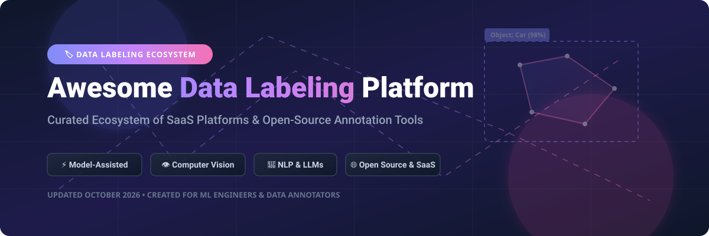
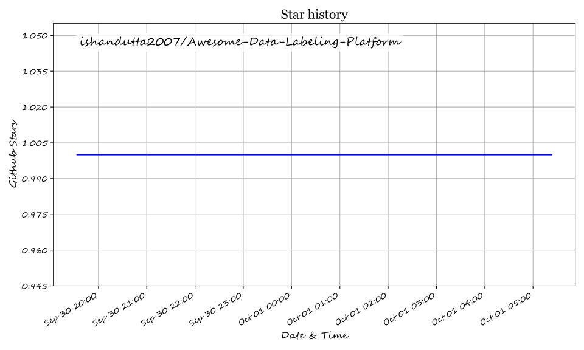

# Awesome Data Labeling Platform 🏷️✨

  

  
  
  
  
  

---

## 🚀 Top Data Labeling & Annotation Ecosystem

**Curated List of Production-Ready SaaS Products & Open-Source GitHub Projects** ⚡

*Focused on Computer Vision Annotation, NLP & LLM RLHF Workflows, Human-in-the-Loop Curation, Model-Assisted Labeling & Training Data Quality Management.* 🎯

**Last updated: October 2026** 📅

---

### 💡 Overview & Ecosystem Insights

This repository tracks top-tier **SaaS platforms** and **open-source annotation tools** for **Data Labeling**. These platforms enable AI/ML teams to annotate images, video, 3D point clouds, text, audio, and multimodal data to construct high-quality training sets for machine learning models and generative AI fine-tuning. 🤖📊

---

## 📊 SaaS / Hosted Platforms

> [!NOTE]
> **Market Size & Sector Concentration Insights 📈**  
> The global Data Labeling and Annotation Market size is estimated at **~$3.8 Billion to $4.5 Billion in 2026** (projected to reach **$13+ Billion by 2030** driven by GenAI & RLHF demand).  
> **Sector Structure:** The market is **moderately fragmented**, with a top-heavy distribution. Leading giants (such as Scale AI) command substantial market share for enterprise workforce annotation, while agile category leaders (Labelbox, Encord, Snorkel, SuperAnnotate) compete vigorously in model-assisted automation and specialized modal workflows.

Below is the list of top commercial data labeling platforms sorted by **Company Valuation / Revenue** in descending order: 🏆

| Platform 🌐 | Description 📝 | Market Footprint / Company Size 💼 | Starting Price 💵 | Free Tier / Trial Limits 🎁 |
| :--- | :--- | :--- | :--- | :--- |
| **[Scale AI](https://scale.com/)** | Managed labeling platform combining automation software with a large human workforce for complex computer vision and LLM RLHF annotation at scale. | **$29 Billion Valuation** (~$2B Annual Revenue est.) | $0.05 / labeling unit (Self-Serve Rapid) | **Free Trial**: 1,000 free labeling units & 10,000 images (or 200 free units/month self-labeling) |
| **[Snorkel Flow / Snorkel AI](https://snorkel.ai/)** | Programmatic labeling and data-centric AI platform for building and iterating training data with weak supervision and foundation models. | **$3.5 Billion Valuation** ($350M Series E raised 2026) | Custom enterprise pricing | **Free Trial**: Sales-assisted demo & select complimentary custom LLM evaluation programs |
| **[Labelbox](https://labelbox.com/)** | Enterprise training-data platform with model-assisted labeling, quality control workflows, and full MLOps pipeline integrations. | **$1 Billion+ Valuation** (Unicorn status) | $0.10 / LBU (Starter plan) | **Free Forever Plan**: 500 LBU credits/month, 30 users, 50 projects |
| **[Dataloop](https://dataloop.ai/)** | End-to-end data management, data pipeline orchestration, and annotation platform for enterprise AI systems. | **$120 Million Valuation** (Acquired by Dell 2025) | Custom enterprise pricing | **Free Trial**: Sales-assisted custom pilot trial / demo upon request |
| **[Encord](https://encord.com/)** | AI data development platform strong on video annotation, DICOM medical imaging, and multimodal quality control workflows. | **$110 Million Total Funding** ($60M Series C 2026) | Custom pricing (Starter / Team / Enterprise) | **Free Trial**: Sales-assisted custom free trial / demo upon request |
| **[SuperAnnotate](https://www.superannotate.com/)** | Annotation and curation platform for images, video, text, and multimodal LLM data with pipeline automation. | **$50 Million Total Funding** (Series B) | Custom pricing (Pro & Enterprise) | **Free Forever Plan**: Up to 3 users and 5,000 items (or Custom Free Trial for Pro) |
| **[V7 / V7 Labs](https://www.v7labs.com/)** | AI data engine for labeling computer vision images, video, and medical documents with auto-annotation agents. | **$40 Million+ Total Funding** | £150 / user / month (~$199/mo) or $499/mo base | **Free Trial**: Demo / Proof of Concept (POC) trial (or historical free tier capped at 100 items) |
| **[Superb AI](https://www.superb-ai.com/)** | Computer vision MLOps & data ops platform specializing in automated dataset curation, labeling, and custom model training. | **$39 Million Total Funding** (Pre-IPO 2025) | Custom enterprise pricing | **Free Trial**: "Start for free" pilot environment / demo upon request |
| **[Kili Technology](https://kili-technology.com/)** | Training data quality and labeling platform with project management, SLA tracking, and multi-modal support. | **$31 Million Total Funding** | Custom pricing (Grow & Enterprise) | **Free Forever Plan**: 200 assets and 2 seats (or 2-week full project evaluation) |
| **[Label Studio Enterprise](https://labelstud.io/)** | Commercial multi-tenant offerings, security, and enterprise team management built on open-source Label Studio. | **HumanSignal Backed** (Multi-Million VC funding) | $99 / month (Starter Cloud) | **Free Trial**: 14-day free trial for Enterprise Cloud (or Open-Source self-hosted unlimited) |
| **[Lightly](https://www.lightly.ai/)** | Self-supervised learning & active learning platform that curates high-value training samples to cut labeling costs. | **Venture Backed** (YC Alum) | Custom Enterprise pricing | **Free Trial / Open Source**: 14-day free trial (Hosted LightlyStudio) & Open Source Apache 2.0 |
| **[CVAT.ai Cloud](https://www.cvat.ai/)** | Hosted cloud service and commercial support built around the open-source Computer Vision Annotation Tool. | **Commercial CVAT.ai Inc.** | $23 / month (Solo plan) | **Free Forever Plan**: 1 project, 3 tasks, 1 GB storage, 100 AI calls/month |
| **[Prodigy](https://prodi.gy/)** | Developer-centric scriptable annotation tool focused on rapid NLP, LLM evaluation, and spaCy workflows. | **Bootstrapped / Profitable** (Explosion AI) | $390 (Personal one-time license) / $490 per seat (Company) | **Free Trial**: No free trial (Interactive web demo available; free academic research licenses on request) |
| **[Keymakr](https://keymakr.com/)** | Managed data annotation services and cloud annotation tool for pixel-accurate computer vision datasets. | **Privately Held Service Leader** | Pay-as-you-go (Startup plan) | **Free Trial**: 7-day free trial for platform testing |
| **[Hasty.ai](https://www.hasty.ai/)** | Vision AI annotation tool with automated pre-labeling assistants (Acquired by CloudFactory). | **Acquired by CloudFactory** | Custom enterprise package | **Free Trial**: Demo upon request via CloudFactory AI Data Platform |
| **[BasicAI](https://www.basic.ai/)** | Cloud data labeling platform supporting 3D LiDAR point clouds, sensor fusion, and computer vision tasks. | **Venture Backed** | $9 / seat / month (Team plan) | **Free Forever Plan**: 5 seats, 200GB storage, 10,000 model calls |

---

## 🛠️ Open-Source GitHub Projects

Below are top open-source annotation repositories sorted by **GitHub Stars_Count** (descending order). Each Stars_Badge directly links to the repository's stargazers page: ⭐

| Repository 📂 | Description 📝 | GitHub_Stars 🌟 | Link 🔗 |
| :--- | :--- | :--- | :--- |
| **[tzutalin/labelImg](https://github.com/tzutalin/labelImg)** | Graphical image annotation tool for bounding boxes in Pascal VOC and YOLO formats. *(Archived legacy leader)* |  | [View Code](https://github.com/tzutalin/labelImg) |
| **[HumanSignal/label-studio](https://github.com/HumanSignal/label-studio)** | Multi-type data labeling tool for image, text, audio, video, time series, and LLM RLHF annotations. |  | [View Code](https://github.com/HumanSignal/label-studio) |
| **[cvat-ai/cvat](https://github.com/cvat-ai/cvat)** | Interactive computer vision annotation tool for images, video tracking, and 3D point cloud labeling. |  | [View Code](https://github.com/cvat-ai/cvat) |
| **[wkentaro/labelme](https://github.com/wkentaro/labelme)** | Polygon and shape annotation tool written in Python for image semantic segmentation datasets. |  | [View Code](https://github.com/wkentaro/labelme) |
| **[doccano/doccano](https://github.com/doccano/doccano)** | Open-source text annotation tool for named entity recognition (NER), sentiment analysis, and translation. |  | [View Code](https://github.com/doccano/doccano) |
| **[CVHub520/X-AnyLabeling](https://github.com/CVHub520/X-AnyLabeling)** | Auto-labeling tool integrated with Segment Anything (SAM), YOLO, and SOTA AI models for image annotation. |  | [View Code](https://github.com/CVHub520/X-AnyLabeling) |
| **[vietanhdev/anylabeling](https://github.com/vietanhdev/anylabeling)** | Auto-labeling tool with Segment Anything (SAM) and YOLO integration for fast computer vision datasets. |  | [View Code](https://github.com/vietanhdev/anylabeling) |
| **[diffgram/diffgram](https://github.com/diffgram/diffgram)** | Open-source data training platform for computer vision, annotation automation, and data pipeline management. |  | [View Code](https://github.com/diffgram/diffgram) |
| **[openlabeling/OpenLabeling](https://github.com/openlabeling/OpenLabeling)** | Lightweight OpenCV-based image and video bounding box annotation tool. |  | [View Code](https://github.com/openlabeling/OpenLabeling) |
| **[lightly-ai/lightly](https://github.com/lightly-ai/lightly)** | Open-source Python library for dataset curation, self-supervised learning, and active sample selection. |  | [View Code](https://github.com/lightly-ai/lightly) |

---

### 📌 Additional Open-Source Extensions & Ecosystem Resources

- **[Label Studio ML Backend](https://github.com/HumanSignal/label-studio-ml-backend)**: Connect custom machine learning models (SAM, YOLO, spaCy, Transformers) for automated pre-labeling.
- **[CVAT Auto Annotation Plugins](https://github.com/cvat-ai/cvat)**: Integrate Deep Learning models into CVAT for video tracking and segment estimation.
- **[Universal Data Tool](https://github.com/UniversalDataTool/universal-data-tool)**: Open-source web/desktop app for annotating images, video, text, and audio.
- **[COCO & YOLO Format Converters](https://github.com/ishandutta2007/Awesome-Awesome-Awesome)**: Utilities to convert labels across Pascal VOC, COCO, YOLO, Label Studio JSON, and TFRecords.

---

## 🤝 How to Contribute

1. Fork the repository. 🍴
2. Create a new branch for your feature or tool addition. 🌿
3. Update `README.md` following the exact table structure. 📝
4. Submit a Pull Request with a clear description. 🚀

---

## ☕ Support & Sponsorship

If you find this curated list valuable for your AI engineering, computer vision, or data labeling workflows:

- ⭐ **Star** this repository to show your support!
- 🔀 **Fork** it to keep a personal copy.
- 📢 **Share** it with your ML and data engineering colleagues!
- 💖 **Sponsor**: You can buy me a coffee and support open-source curation via the [GitHub Sponsors Dashboard](https://github.com/sponsors/ishandutta2007).

---

## ⚠️ Disclaimer

- This repository is a **community-curated list** for informational and educational purposes.
- All brand names, logos, and trademarks belong to their respective owners.
- Ensure proper privacy, security compliance, and annotator agreements when processing proprietary or sensitive datasets.

---

## 📈 Star History

---

**Made with ❤️ for ML engineers, computer vision researchers, and open annotation advocates worldwide.** 🌍

## ⭐ Star History

<a href="https://star-history.com/#ishandutta2007/Awesome-Data-Labeling-Platform&Timeline" align="center">
  <picture>
    <source media="(prefers-color-scheme: dark)" srcset="assets/ishandutta2007_Awesome-Data-Labeling-Platform_growth.svg">
    
  </picture>
</a>
